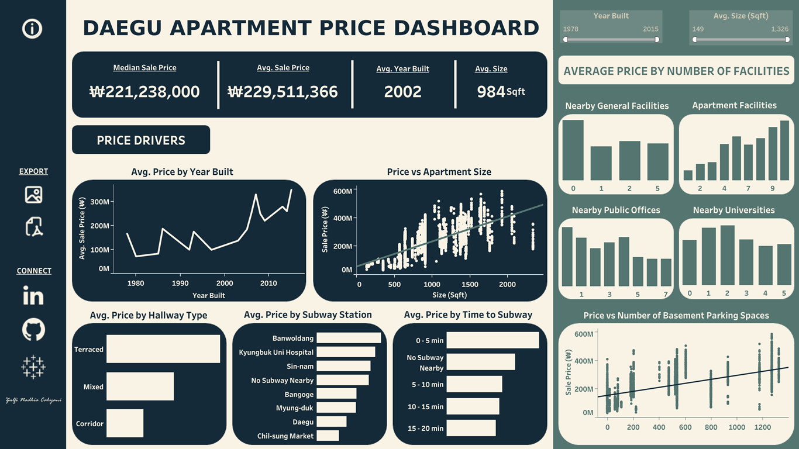

# DAEGU APARTMENT PRICE PREDICTION AND OPTIMIZATION  
This project develops a machine learning regression model to support apartment owners in Daegu, South Korea, by predicting optimal listing prices based on apartment transaction data from 1978 to 2015. Using features such as hallway type, size, year built, proximity to subway stations, and nearby public facilities, the study begins with thorough data cleaning, exploratory analysis, and preprocessing. Multiple regression models are benchmarked and optimized, with the best model selected through hyperparameter tuning and evaluated via test set metrics, residual diagnostics, and feature importance analysis. The final model offers a data-driven, interpretable tool for setting market-aligned apartment prices.

## I. BUSINESS UNDERSTANDING

### **Background**  
Daegu, South Korea’s fourth-largest city with over 2.1 million residents, faces growing housing challenges amid urbanization, with over 57% of homes being high-rise apartments. Despite infrastructure growth, the apartment market has become volatile as prices fell 4.08% in 2024 due to oversupply, high interest rates, and demand shifts. Pricing confusion is worsened by luxury listings far exceeding actual transaction averages (₩726,200/m² citywide, ~₩2.7 million/m² in Suseong-gu). With over half of Daegu’s apartments aged 20+ years and a shortage of new units, owners struggle to price correctly, often relying on guesswork or outdated info. This highlights the urgent need for a data-driven tool to deliver accurate, real-time price predictions and support informed, profitable listing decisions.

### **Business Problem**  
In Daegu’s competitive real estate market, apartment owners struggle to set appropriate prices due to market volatility, misleading online listings, and a lack of reliable pricing tools. These issues often lead to mispricing, either overpricing, which delays sales, or underpricing, which causes financial losses. A data-driven pricing tool powered by machine learning is needed to provide accurate, personalized, and current price recommendations, helping owners reduce uncertainty and make better-informed pricing decisions.

### **Objectives**  
To address the business problems, this project is guided by the following key objectives:

**Project Goals**  
1. **Deliver Accurate and Competitive Pricing:** Use real transaction data and key property features to recommend fair, market-aligned prices.
2. **Minimize Financial Risks from Mispricing:** Prevent losses from underpricing or long delays from overpricing by flagging outliers and suggesting safe pricing ranges.
3. **Improve Sales Efficiency and Buyer Engagement:** Boost chances of faster sales by aligning prices with buyer expectations and current trends.
4. **Promote Market Transparency:** Anchor pricing decisions in real data to foster trust and stability for both sellers and buyers.
5. **Enable Scalable Price Prediction:** Design a system ready for large-scale use, regular updates, and potential automation.

**Machine Learning Objectives**  
1. **Develop a Robust Regression Model:** Train and fine-tune a model to predict apartment prices with high accuracy, minimizing pricing errors.
2. **Interpret Feature Importance:** Use techniques like SHAP to identify and explain which features most influence predicted prices, improving transparency and trust in the model.

### **Analytical Approach**  
This project focuses on building a regression-based machine learning model to help Daegu apartment owners set accurate listing prices. The model is developed using historical transaction data and key property features, refined through data cleaning, feature engineering, and hyperparameter tuning. Final evaluation with residual analysis and SHAP interpretation ensures the model is reliable, transparent, and aligned with market conditions.

### **Evaluation Metrics**  
This project evaluates the regression model using metrics focused on practical relevance and robustness to outliers, primarily MAE and MAPE. RMSE is used complementarily to capture larger errors and assess overall model stability.

### **Scope and Limitations**  
This project develops a machine learning model to estimate apartment prices in Daegu using structured transaction data from 1978 to 2015. Limitations include its focus on Daegu’s historical market without accounting for regional or future changes, reliance on quantitative features only (excluding qualitative factors like school quality or renovations), and a price range restricted to ₩32M–₩586M. Additionally, prices are modeled in won but may be scaled to thousands of won for interpretation, requiring consistency checks during analysis.

---

## II. DATA UNDERSTANDING AND PREPARATION
Data understanding and preparation in this project includes data cleaning, exploratory data analysis (EDA), and data preprocessing. The dataset contains 11 columns: 10 features and the sale price as the target variable, with each row representing a single apartment unit in Daegu, South Korea.

The data cleaning process involves converting incorrect data types, handling missing values, removing duplicates, resolving inconsistencies, treating outliers, and renaming some feature names to ensure a clean and reliable dataset.

During data preprocessing, the following steps were applied:
1. **Scaling (Robust Scaler):** Applied to `NearbyGeneralFacilities`, `NearbyPublicOffices`, `NearbyUniversities`, `BasementParkingSpaces`, `InApartmentFacilities`, and `SizeSqft`.
2. **Encoding:**
    - One-hot encoding for `HallwayType` and `SubwayStation`.
    - Ordinal encoding for `TimeToSubway`.
3. **Binning:**
    - `YearBuilt` categorized into very old, old, modern, and new.
    - `SizeSqft` categorized into small, medium, large, and very large.

---

## III. MODELING AND EVALUATION
Modeling and evaluation focus on developing and refining a regression model to accurately predict apartment prices in Daegu. This chapter begins with benchmarking multiple models to establish baseline performance, followed by hyperparameter tuning and selecting the best-performing model. The final model is thoroughly evaluated using test data and key metrics. Additionally, diagnostics such as residual analysis and feature importance interpretation are conducted to ensure model reliability and transparency, along with assessing the business impact and cost-benefit of the pricing tool.

### **1. Benchmark Model**  
Benchmarking compares ten regression algorithms under identical preprocessing and evaluation settings to establish baseline performance for Daegu apartment price prediction. All models were integrated into a uniform pipeline with consistent scaling, encoding, and binning to ensure fair comparisons based solely on model characteristics. Each was trained on the training set and evaluated on the test set using key metrics: MAE, MAPE, MSE, RMSE, RMSLE, RMSPE, and R². The models range from linear (Multiple Linear, Lasso, Ridge) to non-parametric (KNN, Decision Tree) and ensemble methods (Bagging, Random Forest, Gradient Boosting, XGBoost, CatBoost), balancing interpretability, complexity, and non-linear modeling ability.

### **2. Model Optimization and Selection**  
Model Optimization and Selection involves tuning and evaluating regression models to enhance predictive accuracy. The process starts with hyperparameter tuning using randomized search with 5-fold cross-validation, optimizing parameters like n_neighbors, n_estimators, or max_depth to improve model generalization while avoiding overfitting. Linear models require minimal tuning, but complex models like ensembles benefit significantly.

Following tuning, the best model is selected based on Mean Absolute Error (MAE) and Mean Absolute Percentage Error (MAPE), metrics chosen for their interpretability and practical value in real estate. MAE shows the average price error in the original unit (₩), while MAPE expresses errors as percentages, making performance easier to understand across varying price ranges.

Finally, test set evaluation provides an unbiased measure of real-world performance using metrics like MAE, MAPE, RMSE, RMSLE, R², and RMSPE. Visual tools such as bar plots and scatter plots are used to interpret results and confirm the model's readiness for deployment.

### **3. Model Diagnostics and Interpretation**  
Model diagnostics ensure the final model is not only accurate but also reliable, interpretable, and ready for real-world deployment. This phase covers three essential components:

1. **Residual Analysis**  
Examines the differences between actual and predicted prices to detect issues like bias or non-linearity. Visual tools like distribution plots, Q-Q plots, and residuals vs. predicted plots help validate the model's consistency and spot areas for improvement.

2. **Feature Importance**  
Identifies the most influential features driving predictions, enhancing transparency and trust. XGBoost’s gain-based importance and SHAP values are used to rank features globally and explain individual predictions, supporting explainability and further refinement.

3. **Business Impact**  
Translates model performance into financial value by comparing predictive accuracy against traditional methods. Reductions in MAE, MAPE, and RMSE imply lower pricing risk, with scalable cost savings for apartment owners. Threshold-based alerts help detect mispriced units, while a cost-benefit assessment supports the model's practical adoption and ROI.

---

## IV. CONCLUSION AND RECOMMENDATION

### **Conclusion**   

1. **Model Performance and Selection**  
    - **XGBoost** was selected as the best model after randomized search and cross-validation, with optimized parameters and strong error metrics (**MAE: ₩35.1M**, **MAPE: 17.5%**, **R²: 0.803**).  
    - Delivered **36% - 47% lower errors** than traditional manual pricing, confirming superior predictive accuracy.  
    - Prioritized **MAE and MAPE** for practical interpretability in real-world housing forecasts.  

2. **Business Value and ROI**  
    - Enables **data-driven pricing** using key features (e.g., size, hallway type, year built), replacing subjective estimates.  
    - Built-in **pipeline ensures automated, scalable, and up-to-date predictions**, with alerts for mispricing risks.  
    - Estimated **first-year benefit: ₩155B**, yielding over **5,500× ROI**, with ongoing ROI > **19,000×** due to low maintenance.  

3. **Limitations**    
    - Trained on **Daegu apartment data (1978–2015)**; retraining needed for new regions or market changes.  
    - Predictions are most accurate within the **₩32M–₩586M** price range; extrapolation may reduce reliability.  
    - Lacks **qualitative inputs** (e.g., renovations, school zones); ongoing monitoring and model updates are required.  
    - Values may represent thousands of won rather than individual won; therefore, financial results should be interpreted carefully to avoid misjudgments.

### **Recommendation**   

1. **Expand Geographic and Temporal Coverage**
    - Include data from other cities or national sources.  
    - Apply transfer learning to adapt the model to new regions and market changes.  
    - Monitor recent data regularly to detect temporal drift.

2. **Incorporate Qualitative and External Data**
    - Add features like school ratings, buyer sentiment, renovations, and policy updates.  
    - Use GIS, census, and local government data to enhance model insights.

3. **Implement Robust Monitoring and Maintenance**
    - Automate drift detection with alerts for performance drops.  
    - Schedule periodic retraining with new data and infrastructure changes.  
    - Build CI pipelines for seamless model updates and deployment.

4. **Enforce Unit-Scale Validation and Documentation**
    - Standardize and document price unit scales within data pipelines.  
    - Automate sanity checks to maintain consistent and accurate price interpretations.

---

## REFERENCES

- Bamboo Routes. (n.d.). *9 statistics for the Daegu real estate market in 2025*. Retrieved May 10, 2025, from https://bambooroutes.com/blogs/news/daegu-real-estate-market

- Baroyeon Real Estate. (n.d.). *Why Tower Palace became a symbol of wealth*. Retrieved May 11, 2025, from https://m.baroyeon.co.kr/mLand/Land_View.baro?btype=Land1&mn=&sn=&cn=&page=1&id=1434

- Chung, S.-h., & Kim, M. (2023). *Signs of real estate market recovery seen nationwide in Korea*. Pulse News. Retrieved May 10, 2025, from https://pulse.mk.co.kr/news/english/10817401

- Kavlakoglu, E. (2024). *What is XGBoost?* IBM. Retrieved May 17, 2025, from https://www.ibm.com/think/topics/xgboost

- Kim, S.-j. (2024). *Daegu private apartment average annual sales price ranks third nationwide*. Idaegu.com. Retrieved May 11, 2025, from https://www.idaegu.com/news/articleView.html?idxno=613186

- Kurby Team. (2023). *The evolution of Daegu, South Korea’s real estate market over the last decade*. Kurby. Retrieved May 10, 2025, from https://blog.kurby.ai/the-evolution-of-daegu-south-koreas-real-estate-market-over-the-last-decade/

- World Population Review. (2025). *Daegu population*. World Population Review. Retrieved May 10, 2025, from https://worldpopulationreview.com/cities/south-korea/daegu

- Yoo, H. (2024). *Share of housing in Daegu, South Korea, in 2022 by type*. Statista. Retrieved May 10, 2025, from https://www.statista.com/statistics/1185119/south-korea-housing-types-daegu/

- Yoo, H. (2025). *Housing transactions volume Daegu, South Korea 2009–2024*. Statista. Retrieved May 11, 2025, from https://www.statista.com/statistics/1076475/south-korea-daegu-housing-transactions-volume/

---

## TOOLS USED

- **Python:** Main programming language for data cleaning, preprocessing, modeling, and evaluation.  
- **Pandas and NumPy:** Data manipulation and numerical operations.  
- **Scikit-learn:** Model benchmarking, hyperparameter tuning, and evaluation metrics.  
- **XGBoost:** Gradient boosting implementation used as the final regression model.  
- **Matplotlib and Seaborn:** Data visualization and diagnostic plots (residuals, feature importance).  
- **SHAP:** Model interpretability and feature impact analysis.  
- **Jupyter Notebook:** Interactive development and documentation environment.
- **Tableau:** Interactive dashboard development and visualization.  
  [Daegu Apartment Price Dashboard](https://public.tableau.com/views/DaeguApartmentPriceDashboard/Dashboard?:language=en-US&:sid=&:redirect=auth&:display_count=n&:origin=viz_share_link)

  
